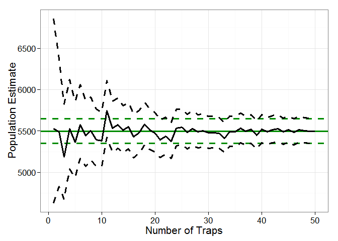
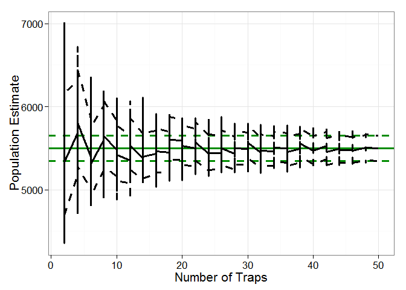
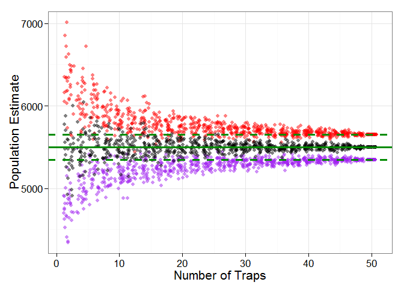
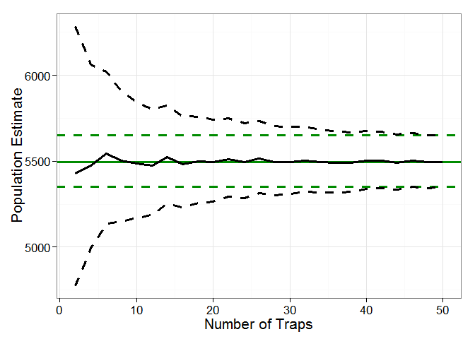
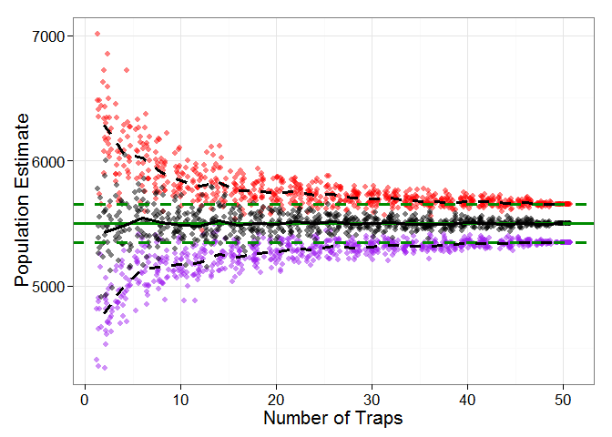
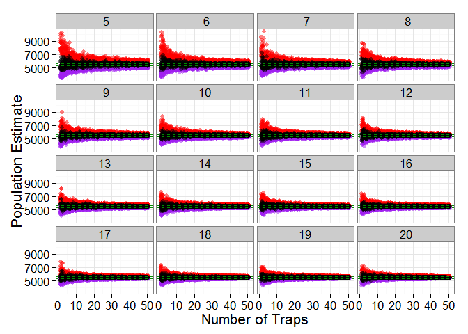
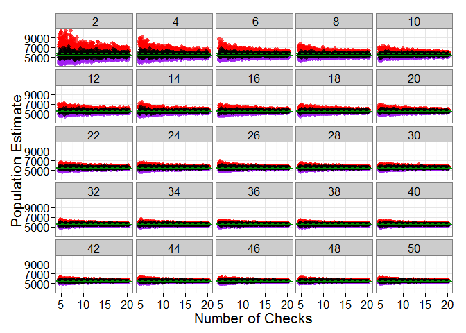
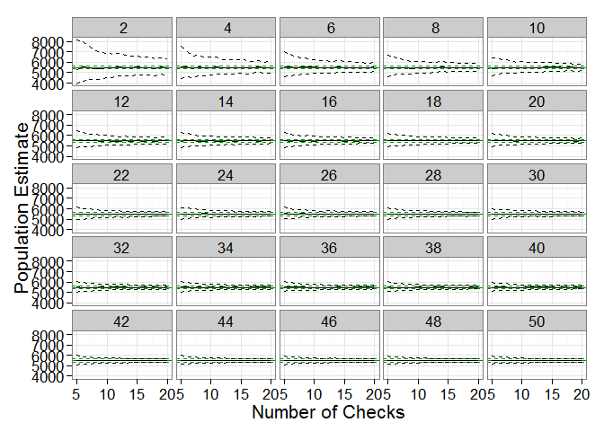

> Ecological studies often suffer from limited resource availability,
> including time, money, and people power. Oversampling not only taxes
> these resources needlessly, but may also negatively influence the
> system being studied; for example, through lethal collections of
> organisms or unnecessary handling of non-target species. Projects
> relying on data collection over multiple field seasons may benefit
> from resampling algorithms that can identify efficient collection
> protocols if oversampling is known or thought to have occurred.

We'll be using a mock data set of tagged and non-tagged eels captured in
a small lake to estimate population size, then build a resampling
algorithm to explore the sensitivity of using varying numbers of traps
and sampling events.

-   400 American eels were captured from a small lake, marked with an
    external tag, and released back into the lake
-   50 traps were checked 20 times over a season
-   number of tagged and non-tagged eels in each trap was recorded

Load Required Packages
----------------------

    library(dplyr)
    library(FSA)
    library(ggplot2)
    library(digest)
    library(lubridate)

You can find the dataset
[here](https://raw.githubusercontent.com/DanielleQuinn/RLessons/master/SensitivityAnalysis/recapture_data.csv)

    df.data<-read.csv("recapture_data.csv")

First, take a look at the data frame `df.data`

    head(df.data)

      trap check present tagged
    1   T1    C1      78      5
    2   T2    C1      75      8
    3   T3    C1      84      5
    4   T4    C1      79      6
    5   T5    C1      78      6
    6   T6    C1      84      5

    str(df.data)

    'data.frame':   1000 obs. of  4 variables:
     $ trap   : Factor w/ 50 levels "T1","T10","T11",..: 1 12 23 34 45 47 48 49 50 2 ...
     $ check  : Factor w/ 20 levels "C1","C10","C11",..: 1 1 1 1 1 1 1 1 1 1 ...
     $ present: int  78 75 84 79 78 84 81 80 83 80 ...
     $ tagged : int  5 8 5 6 6 5 3 10 5 8 ...

Baseline Population Size Estimate
---------------------------------

Before we begin our sensitivity analysis, we need to establish a
baseline that our results will be compared to. In this case our baseline
will be the population size estimated using all of the avilable data.
We'll be using the `mrClosed()` function from the `FSA` package to
estimate the population size using the Schnabel method. Without getting
into too much detail, the Schnbabel method is used when we have multiple
sampling events and assumes a closed population. The function requires
specific input, including:

-   `n`: the number of captured animals
-   `m`: the number of recaptured marked animals
-   `M`: the number of extant marked animals prior to the sample

**Step 1:** Build data frame for `mrClosed()` (`df.cmr`)

Eventually we're going to be repeating this process over a number of
iterations, so we need it to be as efficient as possible to save us
computing time. In this case, we'll use `dplyr` to set up our data
frame. Each row needs to be a check (i.e. sampling event).

    df.cmr<-data.frame(df.data%>%
                         group_by(check)%>%
                         summarise(date=unique(check),n=sum(present), m=sum(tagged), M=400)%>%
                         select(n,m,M))
    head(df.cmr)

         n   m   M
    1 4006 277 400
    2 4036 318 400
    3 4004 302 400
    4 3999 278 400
    5 4012 307 400
    6 4013 287 400

**Step 2:** Estimate population size and confidence limits

    pop.est<-summary(with(df.cmr,mrClosed(n=n,m=m,M=M,method="Schnabel"))) #From FSA package
    pop.low<-stats::confint(with(df.cmr,mrClosed(n=n,m=m,M=M,method="Schnabel")))[1] # Confidence limits #
    pop.high<-stats::confint(with(df.cmr,mrClosed(n=n,m=m,M=M,method="Schnabel")))[2] # Confidence limits #
    baseline<-data.frame(pop.est, pop.low, pop.high)
    baseline

         N pop.low pop.high
    1 5496    5349     5650

We see that using all of the data avilable (50 traps each checked 20
times), our population estimate is 5496, with confidence limits of 5349
and 5650.

Because the lake is very small, we're fairly certain that oversampling
may have occurred. Other indications of oversampling are:

-   more than half of the 400 tagged individuals are often captured in
    every sampling event
-   a huge proportion of the estimated 5496 eels are captured in every
    sampling event

Our goal is to design a sampling protocol for the next year that
maximizes the efficiency of our sampling effort. We want to know the
minimum number of traps and the minimum number of checks that we can do
that will result in a realistic estimate of population size.

Resampling Traps - Sample 10 Random Traps
-----------------------------------------

We'll use the `sample()` function to randomly select 10 of the 50
possible traps.

    all_traps<-unique(df.data$trap) # A vector of all available traps
    all_traps

     [1] T1  T2  T3  T4  T5  T6  T7  T8  T9  T10 T11 T12 T13 T14 T15 T16 T17
    [18] T18 T19 T20 T21 T22 T23 T24 T25 T26 T27 T28 T29 T30 T31 T32 T33 T34
    [35] T35 T36 T37 T38 T39 T40 T41 T42 T43 T44 T45 T46 T47 T48 T49 T50
    50 Levels: T1 T10 T11 T12 T13 T14 T15 T16 T17 T18 T19 T2 T20 T21 ... T9

    use_traps<-sample(all_traps, 10) # Choose 10 random traps
    use_traps

     [1] T42 T46 T25 T32 T17 T7  T6  T28 T27 T34
    50 Levels: T1 T10 T11 T12 T13 T14 T15 T16 T17 T18 T19 T2 T20 T21 ... T9

Subset the data to include only those traps (using `dplyr`), then, just
like before, create `df.cmr` and use `mrClosed()` to estimate population
size.

    my_subset<-data.frame(df.data%>%
      filter(trap %in% use_traps))

    df.cmr<-data.frame(my_subset%>%
                         group_by(check)%>%
                         summarise(date=unique(check),n=sum(present), m=sum(tagged), M=400)%>%
                         select(n,m,M))

    pop.est<-summary(with(df.cmr,mrClosed(n=n,m=m,M=M,method="Schnabel"))) #From FSA package
    pop.low<-stats::confint(with(df.cmr,mrClosed(n=n,m=m,M=M,method="Schnabel")))[1] # Confidence intervals #
    pop.high<-stats::confint(with(df.cmr,mrClosed(n=n,m=m,M=M,method="Schnabel")))[2] # Confidence intervals #
    results<-data.frame(pop.est, pop.low, pop.high)
    results

         N pop.low pop.high
    1 5429    5117     5781

> How does the baseline population estimate compare to the estimate
> using only 10 random traps?

> How do the confidence intervals compare using each of the two method?

    baseline

         N pop.low pop.high
    1 5496    5349     5650

    results

         N pop.low pop.high
    1 5429    5117     5781

Resampling Traps - Sample X Random Traps
----------------------------------------

Repeat this analysis while choosing varying numbers of random traps and
see how the results compare to our baseline population estimates.
Resample from 1 to 50 random traps and apply the analysis for each
subset. Since we're going to be applying an algorithm to multiple
subsets of data, we're going to build a function to make this as
efficient as possible.

**Step 1:** Build a function

This function needs to take a subset of data, produce the `df.cmr` data
frame, and use it to estimate population size and confidence limits.

    my_cmr<-function(my_subset)
    {
      # Build cmr data frame
      df.cmr<-data.frame(my_subset%>%
                            group_by(check)%>%
                            summarise(date=unique(check),n=sum(present), m=sum(tagged), M=400)%>%
                            select(n,m,M))
      
      # Estimate Population Size
      pop.est<<-summary(with(df.cmr,mrClosed(n=n,m=m,M=M,method="Schnabel"))) #From FSA package
      pop.low<<-stats::confint(with(df.cmr,mrClosed(n=n,m=m,M=M,method="Schnabel")))[1] # Confidence intervals #
      pop.high<<-stats::confint(with(df.cmr,mrClosed(n=n,m=m,M=M,method="Schnabel")))[2] # Confidence intervals #
    }

**Step 2:** Set up a data frame to handle the output of the analyses

We want a data frame that has information about how many traps were
randomly selected, and the results of our `my_cmr()` function. In this
case, we're going to have 50 sets of output (1 per random number of
traps we're selecting).

    results<-data.frame(traps=c(1:50), pop.est=NA, pop.low=NA, pop.high=NA)
    results

       traps pop.est pop.low pop.high
    1      1      NA      NA       NA
    2      2      NA      NA       NA
    3      3      NA      NA       NA
    4      4      NA      NA       NA
    5      5      NA      NA       NA
    6      6      NA      NA       NA
    7      7      NA      NA       NA
    8      8      NA      NA       NA
    9      9      NA      NA       NA
    10    10      NA      NA       NA
    11    11      NA      NA       NA
    12    12      NA      NA       NA
    13    13      NA      NA       NA
    14    14      NA      NA       NA
    15    15      NA      NA       NA
    16    16      NA      NA       NA
    17    17      NA      NA       NA
    18    18      NA      NA       NA
    19    19      NA      NA       NA
    20    20      NA      NA       NA
    21    21      NA      NA       NA
    22    22      NA      NA       NA
    23    23      NA      NA       NA
    24    24      NA      NA       NA
    25    25      NA      NA       NA
    26    26      NA      NA       NA
    27    27      NA      NA       NA
    28    28      NA      NA       NA
    29    29      NA      NA       NA
    30    30      NA      NA       NA
    31    31      NA      NA       NA
    32    32      NA      NA       NA
    33    33      NA      NA       NA
    34    34      NA      NA       NA
    35    35      NA      NA       NA
    36    36      NA      NA       NA
    37    37      NA      NA       NA
    38    38      NA      NA       NA
    39    39      NA      NA       NA
    40    40      NA      NA       NA
    41    41      NA      NA       NA
    42    42      NA      NA       NA
    43    43      NA      NA       NA
    44    44      NA      NA       NA
    45    45      NA      NA       NA
    46    46      NA      NA       NA
    47    47      NA      NA       NA
    48    48      NA      NA       NA
    49    49      NA      NA       NA
    50    50      NA      NA       NA

For now, we'll fill in the `pop.est`, `pop.low`, and `pop.high` values
with NA.

**Step 3:** Resample the data and fill in the results data frame

    for(i in 1:nrow(results)) # For each row in our results data frame
    {
      use_traps<-sample(all_traps, results$traps[i]) # Sample x number of random traps
      my_subset<-data.frame(df.data%>%filter(trap %in% use_traps)) # Subset the data to only include those traps
      my_cmr(my_subset) # Apply our my_cmr function to the subset
      results$pop.est[i]<-pop.est # Fill in our results
      results$pop.low[i]<-pop.low
      results$pop.high[i]<-pop.high
    }
    results

       traps pop.est pop.low pop.high
    1      1    5800    4835     7246
    2      2    5027    4443     5787
    3      3    5477    4928     6165
    4      4    6064    5502     6752
    5      5    5522    5079     6049
    6      6    5337    4952     5788
    7      7    5360    4998     5779
    8      8    5449    5100     5848
    9      9    5389    5064     5758
    10    10    5657    5326     6031
    11    11    5454    5154     5791
    12    12    5436    5150     5756
    13    13    5594    5307     5914
    14    14    5484    5214     5782
    15    15    5509    5246     5800
    16    16    5448    5198     5724
    17    17    5685    5426     5970
    18    18    5529    5287     5795
    19    19    5475    5243     5729
    20    20    5445    5220     5690
    21    21    5543    5317     5789
    22    22    5437    5223     5670
    23    23    5435    5226     5663
    24    24    5630    5414     5864
    25    25    5505    5299     5727
    26    26    5429    5232     5642
    27    27    5493    5295     5705
    28    28    5497    5303     5706
    29    29    5490    5300     5694
    30    30    5528    5339     5732
    31    31    5551    5363     5752
    32    32    5456    5276     5649
    33    33    5491    5312     5683
    34    34    5483    5307     5672
    35    35    5544    5367     5732
    36    36    5543    5369     5728
    37    37    5443    5276     5622
    38    38    5470    5303     5647
    39    39    5484    5319     5659
    40    40    5464    5302     5636
    41    41    5479    5318     5649
    42    42    5474    5316     5642
    43    43    5462    5305     5627
    44    44    5500    5344     5666
    45    45    5480    5327     5643
    46    46    5525    5371     5688
    47    47    5490    5339     5649
    48    48    5506    5356     5665
    49    49    5493    5345     5650
    50    50    5496    5349     5650

Looking at `results`, you can see that when we sample 2 random traps,
our population estimate is 5027

**Step 4:** Visualize results

> How does changing the number of traps sampled change the population
> estimate?

    my_plot1<-ggplot(results)+
      geom_line(aes(x=traps, y=pop.est), size=1.25)+
      geom_line(aes(x=traps, y=pop.low), size=1.25, linetype='dashed')+
      geom_line(aes(x=traps, y=pop.high), size=1.25, linetype='dashed')+
      theme_bw(16)+xlab("Number of Traps")+ylab("Population Estimate")
    my_plot1

> How do these results compare to our baseline estimate?

    my_plot2<-ggplot(results)+
      geom_hline(yint=baseline$N, size=1.25, col='green4')+
      geom_hline(yint=baseline$pop.low, size=1.25, col='green4', linetype='dashed')+
      geom_hline(yint=baseline$pop.high, size=1.25, col='green4', linetype='dashed')+
      geom_line(aes(x=traps, y=pop.est), size=1.25)+
      geom_line(aes(x=traps, y=pop.low), size=1.25, linetype='dashed')+
      geom_line(aes(x=traps, y=pop.high), size=1.25, linetype='dashed')+
      theme_bw(16)+xlab("Number of Traps")+ylab("Population Estimate")
    my_plot2

Because random traps are selected each time, your results will look
slightly different. However, you should see the same amount of general
variation in population estimates.

> Why is there so much variation?

Because we're only randomly selecting each number of traps a single
time. To get a better idea of the overall sensitivity of the population
estimate to the number of traps used, we'll repeat this resampling
algorithm for many iterations.

Resampling Traps - Iterations
-----------------------------

This time instead of varying the number of traps to be 1 to 50, we'll
limit those options to be from 2 to 50 by 2 (i.e. 2, 4, 6, ...50).

Then we'll repeat the whole algorithm 30 times.

**Step 1:** Build a function - already done! (`my_cmr()`)

**Step 2:** Set up a data frame to handle the output of the analyses

In this case, we're going to have 25 (different numbers of traps to
select) x 30 (repeats) outputs, for a total of 750 iterations:

    results<-data.frame(traps=rep(seq(from=2, to=50, by=2),30), pop.est=NA, pop.low=NA, pop.high=NA)
    head(results)

      traps pop.est pop.low pop.high
    1     2      NA      NA       NA
    2     4      NA      NA       NA
    3     6      NA      NA       NA
    4     8      NA      NA       NA
    5    10      NA      NA       NA
    6    12      NA      NA       NA

**Step 3:** Resample and fill in the results data frame

In addition, we'll set up a means of keeping track of how long the
resampling takes, and how long each iteration takes to complete. Being
able to estimate how long your algorithm will take to complete will help
you make decisions about how many iterations you can or should
realistically set up.

    starttime=Sys.time() # What time does the resampling begin?
    for(i in 1:nrow(results))
    {
      use_traps<-sample(all_traps, results$traps[i])
      my_subset<-data.frame(df.data%>%filter(trap %in% use_traps))
      my_cmr(my_subset)
      results$pop.est[i]<-pop.est
      results$pop.low[i]<-pop.low
      results$pop.high[i]<-pop.high
    }
    totaltime<-difftime(Sys.time(),starttime, unit="secs") #How long did it take?
    totaltime

    Time difference of 3.681289 secs

    per.it<-round(as.numeric(totaltime)/nrow(results),3)
    paste(per.it,"seconds per iteration") # How long did each iteration take?

    [1] "0.005 seconds per iteration"

Depending on the processing power of your computer, each iteration took
approximately 0.005.

**Step 4:** Visualize results

    my_plot3<-ggplot(results)+
      geom_hline(yint=baseline$N, size=1.25, col='green4')+
      geom_hline(yint=baseline$pop.low, size=1.25, col='green4',linetype='dashed')+
      geom_hline(yint=baseline$pop.high, size=1.25, col='green4',linetype='dashed')+
      geom_line(aes(x=traps, y=pop.est), size=1.25)+
      geom_line(aes(x=traps, y=pop.low), size=1.25, linetype='dashed')+
      geom_line(aes(x=traps, y=pop.high), size=1.25, linetype='dashed')+
      theme_bw(16)+xlab("Number of Traps")+ylab("Population Estimate")
    my_plot3

> Why do we have jagged lines?

Because each value of traps has 90 points associate with it (30
population estimates, 30 upper confidence limits, and 30 lower
confidence limits). There are multiple ways to deal with this.

*Option 1:* Don't use a line to represent the resampled data.

Black points represent population estimates, purple points represent
lower confidence limits, and red points represent upper confidence
limits.

    my_plot4<-ggplot(results)+
      geom_jitter(aes(x=traps, y=pop.low), col='purple', alpha=0.5)+
      geom_jitter(aes(x=traps, y=pop.high), col='red', alpha=0.5)+
      geom_jitter(aes(x=traps, y=pop.est), alpha=0.5)+
      geom_hline(yint=baseline$N, size=1.25, col='green4')+
      geom_hline(yint=baseline$pop.low, size=1.25, col='green4',linetype='dashed')+
      geom_hline(yint=baseline$pop.high, size=1.25, col='green4',linetype='dashed')+
      theme_bw(16)+xlab("Number of Traps")+ylab("Population Estimate")
    my_plot4

This option is great for seeing all of your results without any summary
techniques being applied (mean, etc.).

*Option 2:* Summarize the data before plotting.

    results.sum<-data.frame(results%>%
      group_by(traps)%>%
      summarise(mean.pop=mean(pop.est), mean.low=mean(pop.low), mean.high=mean(pop.high)))

    my_plot5<-ggplot(results.sum)+
      geom_hline(yint=baseline$N, size=1.25, col='green4')+
      geom_hline(yint=baseline$pop.low, size=1.25, col='green4',linetype='dashed')+
      geom_hline(yint=baseline$pop.high, size=1.25, col='green4',linetype='dashed')+
      geom_line(aes(x=traps, y=mean.pop), size=1.25)+
      geom_line(aes(x=traps, y=mean.low), size=1.25, linetype='dashed')+
      geom_line(aes(x=traps, y=mean.high), size=1.25, linetype='dashed')+
      theme_bw(16)+xlab("Number of Traps")+ylab("Population Estimate")
    my_plot5

This option is great for simplifying your results to produce clean
polts, but when it comes time to interpret these plots you need to be
aware that the solid line represents the average response, and the
dashed line represents the standard deviation around these mean values.

*Option 3:* Combine these methods.

    my_plot6<-ggplot(results.sum)+
      geom_jitter(aes(x=traps, y=pop.low), col='purple', alpha=0.5, data=results)+
      geom_jitter(aes(x=traps, y=pop.high), col='red', alpha=0.5, data=results)+
      geom_jitter(aes(x=traps, y=pop.est), alpha=0.5, data=results)+
      geom_hline(yint=baseline$N, size=1.25, col='green4')+
      geom_hline(yint=baseline$pop.low, size=1.25, col='green4',linetype='dashed')+
      geom_hline(yint=baseline$pop.high, size=1.25, col='green4',linetype='dashed')+
      geom_line(aes(x=traps, y=mean.pop), size=1.25)+
      geom_line(aes(x=traps, y=mean.low), size=1.25, linetype='dashed')+
      geom_line(aes(x=traps, y=mean.high), size=1.25, linetype='dashed')+
      theme_bw(16)+xlab("Number of Traps")+ylab("Population Estimate")
    my_plot6

Even though the plots are a little messy, you can start to see that when
few traps are used, the population estimates are much more variable than
if many traps are used.

Resampling Traps and Checks - Iterations
----------------------------------------

Recall that each trap was checked 20 times. Imagine all of the time and
effort that would be saved if we could sample traps fewer times and
still be confident in our population estimates! In addition to exploring
the sensitivity of the number of traps, let's add another level to this
analysis and include a varying number of checks. We'll say that we want
to see what would happen if 5 to 20 checks were done.

    all_checks<-unique(df.data$check)
    all_checks

     [1] C1  C2  C3  C4  C5  C6  C7  C8  C9  C10 C11 C12 C13 C14 C15 C16 C17
    [18] C18 C19 C20
    20 Levels: C1 C10 C11 C12 C13 C14 C15 C16 C17 C18 C19 C2 C20 C3 C4 ... C9

Because we've been keeping track of how long each iteration takes
(approx. 0.005 seconds, depending on the processing power of your
computer), we know that we can easily do more iterations within a
reasonable time frame. We'll do 40 repeats this time.

**Step 1:** Build a function - already done!

**Step 2:** Set up a data frame to handle the output of the analyses

In this case, we're going to have 25 (different numbers of traps to
select) x 16 (different numbers of checks to select) x 40 (repeats)
outputs for a total of 16400 iterations. Using `expand.grid()` will be
useful here; it creates a dataframe of every combination of each
argument you give it.

    results<-expand.grid(traps=seq(from=2, to=50, by=2), checks=c(5:20), repeats=c(0:40))
    nrow(results) # How many iterations?

    [1] 16400

    nrow(results)*per.it/60 # Based on our estimated time per iteration from previous results, how long will this take?

    [1] 1.366667

    # We can get rid of the repeats column
    results<-results[,-3]

    # And need to add the pop.est, pop.low, and pop.high columns
    results$pop.est<-NA
    results$pop.low<-NA
    results$pop.high<-NA

**Step 3:** Resample and fill in the results data frame

    starttime=Sys.time()
    for(i in 1:nrow(results))
    {
      # print(paste(i/nrow(results)*100, "% Complete")) # This is useful for keeping track of how many iterations have been completed
      use_traps<-sample(all_traps, results$traps[i])
      use_checks<-sample(all_checks, results$checks[i])
      my_subset<-data.frame(df.data%>%filter(trap %in% use_traps)%>%filter(check %in% use_checks))
      my_cmr(my_subset)
      results$pop.est[i]<-pop.est
      results$pop.low[i]<-pop.low
      results$pop.high[i]<-pop.high
    }
    totaltime<-difftime(Sys.time(),starttime, unit="secs")
    totaltime

    Time difference of 211.5261 secs

    per.it<-round(as.numeric(totaltime)/nrow(results),3)
    paste(per.it,"seconds per iteration")

    [1] "0.013 seconds per iteration"

**Step 4:** Visualize results

**Option 1:** Don't use a line to represent the resampled data.

Use facet\_wrap to look at grouped by number of checks.

    my_plot7<- ggplot(results)+
      geom_jitter(aes(x=traps, y=pop.low), col='purple', alpha=0.5)+
      geom_jitter(aes(x=traps, y=pop.high), col='red', alpha=0.5)+
      geom_jitter(aes(x=traps, y=pop.est), alpha=0.5)+
      geom_hline(yint=baseline$N, col='green4')+
      geom_hline(yint=baseline$pop.low, col='green4',linetype='dashed')+
      geom_hline(yint=baseline$pop.high, col='green4',linetype='dashed')+
      theme_bw(16)+xlab("Number of Traps")+ylab("Population Estimate")+
      facet_wrap(~checks)
    my_plot7

Use facet\_wrap to look at grouped by number of traps.

    my_plot8<-ggplot(results)+
      geom_jitter(aes(x=checks, y=pop.low), col='purple', alpha=0.7)+
      geom_jitter(aes(x=checks, y=pop.high), col='red', alpha=0.7)+
      geom_jitter(aes(x=checks, y=pop.est), alpha=0.7)+
      geom_hline(yint=baseline$N, col='green4')+
      geom_hline(yint=baseline$pop.low, col='green4',linetype='dashed')+
      geom_hline(yint=baseline$pop.high, col='green4',linetype='dashed')+
      theme_bw(16)+xlab("Number of Checks")+ylab("Population Estimate")+
      facet_wrap(~traps)
    my_plot8

*Option 2:* Summarize the data before plotting.

    results.sum<-data.frame(results%>%
                              group_by(traps, checks)%>%
                              summarise(mean.pop=mean(pop.est), mean.low=mean(pop.low), mean.high=mean(pop.high)))

    my_plot9<-ggplot(results.sum)+
      geom_hline(yint=baseline$N, col='green4')+
      geom_hline(yint=baseline$pop.low, col='green4',linetype='dashed')+
      geom_hline(yint=baseline$pop.high, col='green4',linetype='dashed')+
      geom_line(aes(x=traps, y=mean.pop))+
      geom_line(aes(x=traps, y=mean.low), linetype='dashed')+
      geom_line(aes(x=traps, y=mean.high), linetype='dashed')+
      theme_bw(16)+xlab("Number of Traps")+ylab("Population Estimate")+
      facet_wrap(~checks)
    my_plot9

    my_plot10<-ggplot(results.sum)+
      geom_hline(yint=baseline$N, col='green4')+
      geom_hline(yint=baseline$pop.low, col='green4',linetype='dashed')+
      geom_hline(yint=baseline$pop.high, col='green4',linetype='dashed')+
      geom_line(aes(x=checks, y=mean.pop))+
      geom_line(aes(x=checks, y=mean.low), linetype='dashed')+
      geom_line(aes(x=checks, y=mean.high), linetype='dashed')+
      theme_bw(16)+xlab("Number of Checks")+ylab("Population Estimate")+
      facet_wrap(~traps)
    my_plot10

You can use these plots to visually identify the number of traps and the
number of checks that result in population estimates that you consider
to be acceptable. From there you can design more efficient sampling
protocols for next year! These results can give us valuable information
about how to save time and money, and, with the appropriate data, can
also be used to avoid oversampling sensitive ecosystems or non-target
species.

> **So how much money and time can we actually save?** Originally, 50
> traps were checked 20 times each, for a total of 1000 sampling events.
> It appears that approprite estimates of population size could be made
> using as few traps as 30, if checked 15 times, or as few checks as 10,
> if 45 traps are used. Of course, these are only rough visual
> estimates, and these results could be explored much further using
> additional quantitative methods However if we assume that each trap
> costs $50 and it takes a student 20 minutes to check each trap (pull
> up, count eels, record data, rebait, and redeploy), our original
> samples cost us $2500 and took over 334 hours to complete. Checking 30
> traps 15 times (*possible option 1*) would cost us $1500 and take 150
> hours to complete, and checking 45 traps 10 times (*possible option
> 2*) would cost us $2250 and also take us 150 hours to complete.
> Evaluating these situations can greatly enhance our ability to
> efficiently design sampling protocols and save both time and money!
